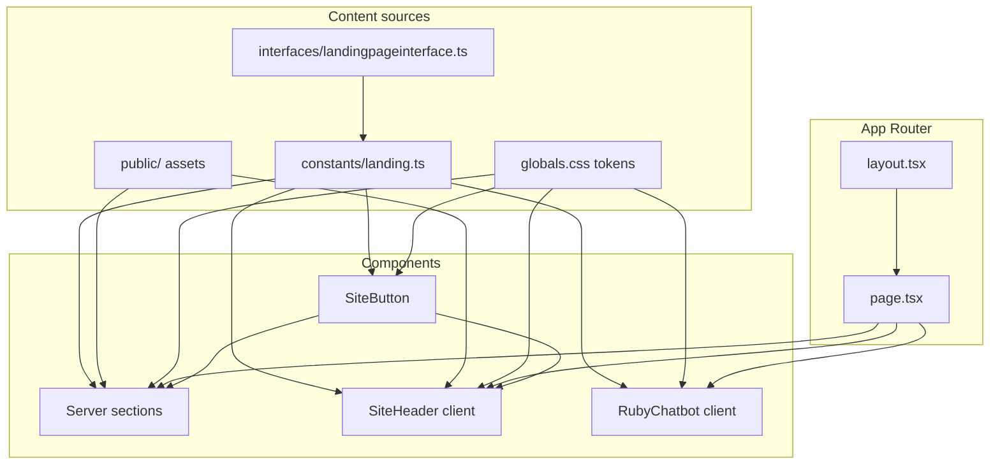

# Data flow

How content and UI state move through this app. There is **no backend API** for the landing: copy is static modules, and only two client islands hold local UI state.

## Big picture



## 1. Typed content layer

1. Shapes live in [`src/interfaces/landingpageinterface.ts`](../src/interfaces/landingpageinterface.ts)  
   (`Promo`, `Hero`, `DualCore`, `FaqSectionData`, `FooterContent`, `RubyChatContent`, …).
2. Concrete values live in [`src/constants/landing.ts`](../src/constants/landing.ts)  
   (`promo`, `navPrimary`, `hero`, `marquee`, `dualCore`, `monthlySprint`, `ctcScore`, `infraStrip`, `faq`, `siteFooter`, `rubyChat`, …).

**Rule:** change copy or links in `landing.ts` first; components should not hard-code marketing text.

## 2. Page composition (one-way render)

[`src/app/page.tsx`](../src/app/page.tsx) is a **Server Component**. It imports sections and mounts them in a fixed order:

```text
SiteHeader (PromoBanner as children)
  └─ main
       HeroSection
       TrustMarquee
       DualCoreSection
       MonthlySprintSection  → MonthlyContestCard
       CtcScoreSection
       InfraStripSection
       FaqSection
       sr-only hash stubs
  SiteFooter
  RubyChatbot
```

Data flow at this layer is **unidirectional**:

`landing.ts` → section component props/imports → HTML.

No React Context, Redux, or server fetches for landing content.

## 3. Section → constant mapping

| UI | Constant(s) |
|----|-------------|
| PromoBanner | `promo` |
| SiteHeader / LoginButton | `navPrimary`, `navSecondary`, `navLogin` |
| HeroSection | `hero` |
| TrustMarquee | `marquee` |
| DualCoreSection | `dualCore` |
| MonthlySprintSection + MonthlyContestCard | `monthlySprint` (+ nested `contest`) |
| CtcScoreSection | `ctcScore` |
| InfraStripSection | `infraStrip` |
| FaqSection | `faq` |
| SiteFooter | `siteFooter` |
| RubyChatbot | `rubyChat` |
| SiteButton | receives labels/hrefs from parents (which read the constants above) |

## 4. Shared button path

```text
landing CTA fields (href, label, variant)
        ↓
SiteButton / LoginButton
        ↓
next/link  or  <button>
```

Hero and Dual-Core map `primary` / `ghost` (or Dual-Core’s `ghost`) onto `SiteButton` variants. Login maps size to `compact` / `block`.

## 5. Client state (local only)

| Island | State | Persistence |
|--------|--------|-------------|
| `SiteHeader` | Mobile menu open/closed | None (in-memory) |
| `RubyChatbot` | Panel open/closed; `mounted` for portal | None (UI-only) |

These do **not** push data up to the page or into constants. Closing the menu or chat does not change landing content.

## 6. Assets and tokens

```text
public/assets/images/*     → next/image /  / CSS
public/icon.svg, icon.png  → metadata icons
public/white_logo.png      → Open Graph / Twitter images
public/assets/styles/fonts.css → linked from layout

globals.css :root + @theme → Tailwind token classes on components
```

Images are referenced by path strings inside `landing.ts` (e.g. `hero.imageSrc`) or fixed paths in header/footer.

## 7. Navigation / deep links

Nav and footer hrefs are mostly **hash links** on the same page (`#explore`, `#faq`, `#contact`, …).

```text
User clicks link
  → browser scrolls to element id
  → ids come from section roots (e.g. DualCore id="ecosystem")
     or sr-only stubs on page.tsx
```

No router transitions between product pages on this clone.

## 8. Metadata flow

[`src/app/layout.tsx`](../src/app/layout.tsx) exports Next.js `metadata` / `viewport` (title, description, OG, favicon). That is independent of `landing.ts` section content but mirrors the live CTC site.

## Mental model

| Layer | Responsibility |
|-------|----------------|
| Interfaces | What content is allowed |
| Constants | What content is |
| Components | How content looks |
| Page | In what order content appears |
| Layout | Document shell + SEO |
| Client islands | Ephemeral UI chrome only |

---

See also: [Getting started](./getting-started.md) · [Components](./components.md)
